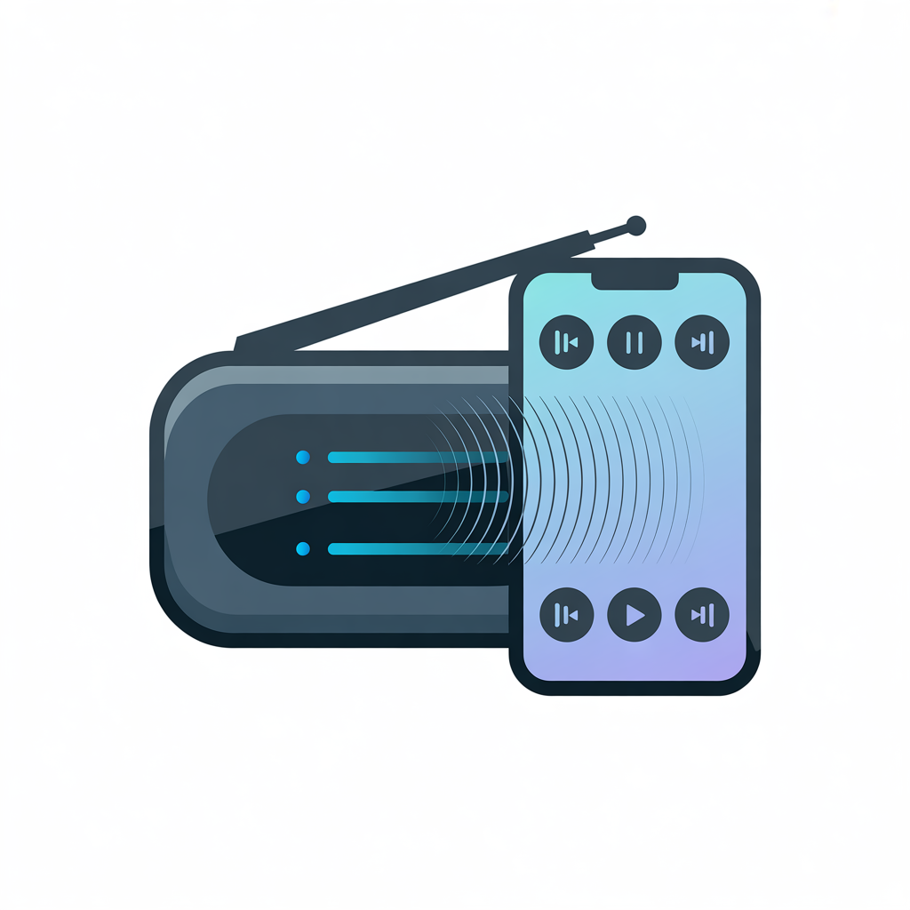

<p align="center">
  
</p>

<h1 align="center">OD Remote</h1>

<p align="center">
  A Flutter Android app for controlling Ocean Digital streaming radios on your local network.
</p>

## Features

- **Manage multiple radios** — save radios by name and IP address, edit or remove them anytime
- **Browse favorites** — view the full favorites list from your radio, paginated automatically
- **One-tap playback** — tap a station to start playing it immediately
- **Now playing** — see the current station and playback status, auto-refreshing every 5 seconds
- **Pull to refresh** — swipe down to reload the favorites list

## Screenshots

*Coming soon*

## Getting Started

### Prerequisites

- Flutter SDK
- Android SDK with a connected device or emulator

### Build & Run

```sh
flutter pub get
flutter run
```

### Usage

1. Tap **+** to add a radio — give it a name and enter its IP address or hostname
2. Tap the radio to open its favorites list
3. Tap any station to start playing

## Radio API

OD Remote communicates with Ocean Digital radios over HTTP using three endpoints:

| Endpoint | Purpose |
|---|---|
| `GET /php/playing.php` | Returns JSON with the currently playing station |
| `GET /php/favList.php?PG=<page>` | Returns the favorites list (JS format, parsed via regex) |
| `GET /doApi.cgi?AI=16&CI=<index>` | Plays a station by its index in the favorites list |

## Project Structure

```
lib/
  main.dart                  — App entry point
  models/
    radio_device.dart        — Radio data model (name, host)
    station.dart             — Station data model (name, url, index)
  services/
    radio_api.dart           — HTTP calls + response parsing
    radio_storage.dart       — Persists saved radios via SharedPreferences
  screens/
    radio_list_screen.dart   — Radio selector / configuration
    now_playing_screen.dart  — Favorites list + now playing bar
  widgets/
    station_tile.dart        — Favorite station list tile
    now_playing_bar.dart     — Current station display
```
